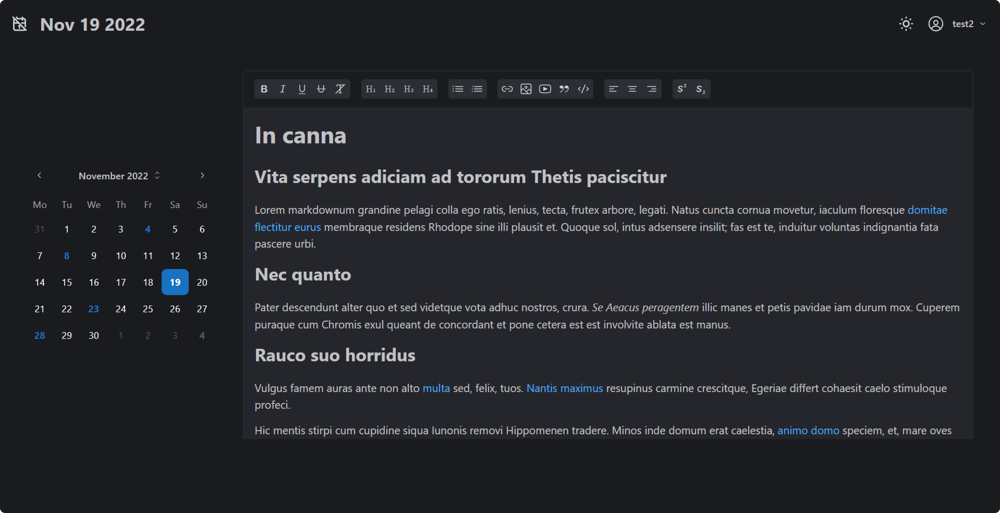

<a href="https://app.journal-app.pub">
  
  <h1 align="center">Journal App</h1>
</a>

 A web app for journaling your thoughts every day.

### Tech Stack

- **Framework:** [React](https://nextjs.org) [ExpressJS](https://expressjs.com/)
- **React Component Library:** [Mantine](https://mantine.dev/)
- **User Management:** [Firebase](https://firebase.google.com/)
- **Database:** [MongoDB](https://www.mongodb.com/)
- **Deployment:** [Vercel](https://vercel.com/)

## Features

- Data Fetching using **Axios**
- Creation, edition and deletion of notes using API endpoints.
- Schema validation using **Joi**
- Rich text editing using **Mantine**
- State management using **Zustand**
- Collapsible calendar
- Theme colors
- Dark theme
- Written in **TypeScript**
